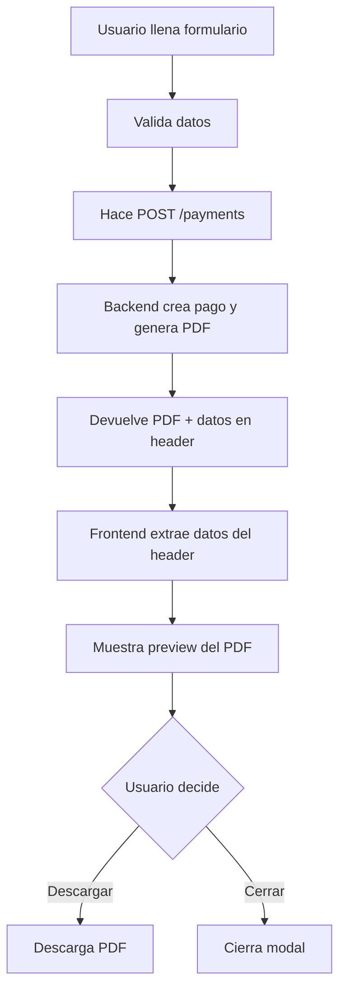

# Módulo de Pagos - Frontend

## Cambios Implementados

### 1. Actualización de Entidades

Se agregaron los nuevos campos requeridos por el backend:

```typescript
interface PaymentEntity {
  // ... campos existentes
  buyerDocument: string;      // Cédula del comprador (10 dígitos)
  buyerName: string;          // Nombre completo (2 nombres + 2 apellidos)
  buyerDirection: string | null; // Dirección (opcional)
}
```

### 2. Manejo de Respuesta PDF

El endpoint `POST /payments` ahora devuelve:
- **PDF**: Como archivo blob en el body de la respuesta
- **Datos del Pago**: En el header `X-Payment-Data` como JSON

El repositorio maneja automáticamente esta respuesta:

```typescript
interface CreatePaymentResponse {
  payment: PaymentEntity;  // Datos extraídos del header
  pdfBlob: Blob;          // PDF del comprobante
}
```

### 3. Nuevos Componentes

#### `CreatePaymentForm`

Formulario completo para crear pagos con:
- Búsqueda automática de personas registradas por cédula
- Validación de campos según reglas del backend
- Generación automática de PDF al crear el pago
- Vista previa del comprobante generado

**Uso:**

```tsx
import { CreatePaymentForm } from '@/features/payment';

function MyComponent() {
  return (
    <CreatePaymentForm
      procedureType="burial"
      procedureId="uuid-del-tramite"
      defaultAmount={150.00}
      onSuccess={() => console.log('Pago creado')}
    />
  );
}
```

#### `PdfPreviewDialog`

Modal para visualizar y descargar el comprobante de pago:
- Vista previa en iframe
- Botón de descarga
- Muestra información del pago (código y monto)

**Uso:**

```tsx
import { PdfPreviewDialog } from '@/features/payment';

function MyComponent() {
  const [open, setOpen] = useState(false);
  const [pdfBlob, setPdfBlob] = useState<Blob | null>(null);
  const [payment, setPayment] = useState<PaymentEntity | null>(null);

  return (
    <PdfPreviewDialog
      open={open}
      onOpenChange={setOpen}
      pdfBlob={pdfBlob}
      payment={payment}
    />
  );
}
```

## Validaciones del Formulario

### Cédula del Comprador
- Debe tener exactamente 10 dígitos
- Solo números
- Campo obligatorio

```typescript
buyerDocument: z.string().regex(/^\d{10}$/)
```

### Nombre del Comprador
- Debe contener 2 nombres y 2 apellidos
- Separados por espacios
- Solo letras, espacios y caracteres españoles (áéíóúñ)
- Campo obligatorio

```typescript
buyerName: z.string().regex(
  /^[A-Za-zÁÉÍÓÚáéíóúÑñ\s]{2,}\s[A-Za-zÁÉÍÓÚáéíóúÑñ\s]{2,}\s[A-Za-zÁÉÍÓÚáéíóúÑñ\s]{2,}\s[A-Za-zÁÉÍÓÚáéíóúÑñ\s]{2,}$/
)
```

**Ejemplo válido:** Juan Carlos Pérez López

### Dirección
- Campo opcional
- Sin restricciones de formato

## Funcionalidad de Búsqueda

El formulario permite buscar personas registradas en el sistema:

1. Usuario ingresa la cédula de 10 dígitos
2. Presiona el botón de búsqueda (ícono de lupa)
3. Si encuentra una persona viva registrada:
   - Se autocompleta el nombre completo
   - Se autocompleta la dirección (si existe)
4. Si no encuentra: Usuario puede ingresar los datos manualmente

**Nota:** Solo busca personas NO fallecidas (`fallecido: false`)

## Flujo de Creación de Pago



## Hooks Actualizados

### `useCreatePayment`

```typescript
const createPayment = useCreatePayment();

const handleCreate = async (data: CreatePaymentEntity) => {
  const result = await createPayment.mutateAsync(data);
  
  // result.payment: Datos del pago creado
  // result.pdfBlob: Blob del PDF para preview/descarga
  
  // Mostrar preview
  setPdfBlob(result.pdfBlob);
  setPayment(result.payment);
  setShowPreview(true);
};
```

## Integración con Otros Módulos

Para integrar el módulo de pagos en otros módulos (inhumaciones, exhumaciones, etc.):

```tsx
import { CreatePaymentForm } from '@/features/payment';

function InhumacionCreate() {
  const [showPaymentForm, setShowPaymentForm] = useState(false);
  
  return (
    <div>
      {/* ... Formulario de inhumación ... */}
      
      {showPaymentForm && (
        <CreatePaymentForm
          procedureType="burial"
          procedureId={inhumacionId}
          defaultAmount={calculateAmount()}
          onSuccess={() => {
            // Actualizar estado del trámite
            // Redirigir, cerrar modal, etc.
          }}
        />
      )}
    </div>
  );
}
```

## Tipos de Trámites Disponibles

```typescript
type ProcedureType = 
  | 'burial'           // Inhumación
  | 'exhumation'       // Exhumación
  | 'niche_sale'       // Venta de Nicho
  | 'tomb_improvement' // Mejora de Tumba
  | 'hole_extension';  // Ampliación de Hueco
```

## Ejemplo Completo de Uso

```tsx
"use client";

import { useState } from "react";
import { CreatePaymentForm } from "@/features/payment";
import { Button } from "@/shared/components/ui/button";
import { Dialog, DialogContent, DialogTrigger } from "@/shared/components/ui/dialog";

export function MyProcedureComponent() {
  const [open, setOpen] = useState(false);
  
  return (
    <Dialog open={open} onOpenChange={setOpen}>
      <DialogTrigger asChild>
        <Button>Generar Pago</Button>
      </DialogTrigger>
      
      <DialogContent className="max-w-3xl">
        <CreatePaymentForm
          procedureType="burial"
          procedureId="uuid-del-tramite"
          defaultAmount={150.00}
          onSuccess={() => {
            setOpen(false);
            // Lógica adicional después de crear el pago
          }}
        />
      </DialogContent>
    </Dialog>
  );
}
```

## Notas Importantes

1. **Vista Previa del PDF**: Se muestra automáticamente después de crear el pago
2. **Descarga**: El usuario puede descargar el PDF desde el modal de preview
3. **Validación**: Todas las validaciones se hacen antes de enviar al backend
4. **Búsqueda de Personas**: Solo busca personas vivas (no fallecidas)
5. **Header Custom**: El backend devuelve los datos del pago en `X-Payment-Data`
6. **Formato de Respuesta**: El backend devuelve el PDF como blob con `Content-Type: application/pdf`

## Troubleshooting

### El PDF no se muestra
- Verificar que el backend está devolviendo `Content-Type: application/pdf`
- Verificar que el header `X-Payment-Data` existe
- Revisar la consola del navegador para errores

### La búsqueda de personas no funciona
- Verificar que el endpoint `/personas/search` esté funcionando
- Verificar que la cédula tiene exactamente 10 dígitos
- Verificar que la persona existe y no está marcada como fallecida

### Error de validación en nombre
- El nombre debe tener exactamente 4 palabras (2 nombres + 2 apellidos)
- Separadas por un solo espacio
- Solo letras y caracteres españoles permitidos
